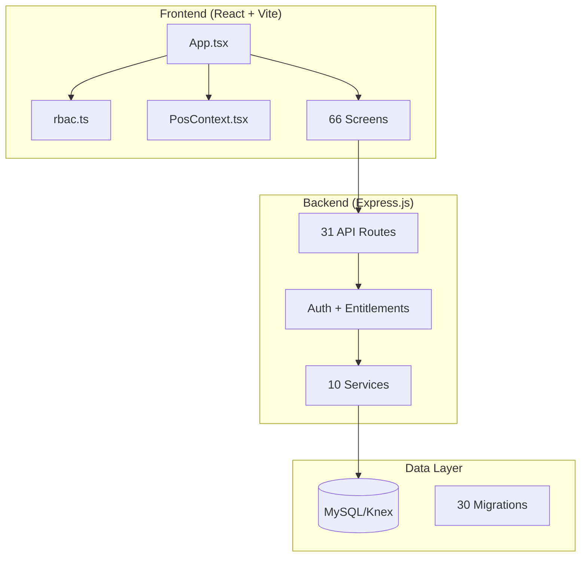
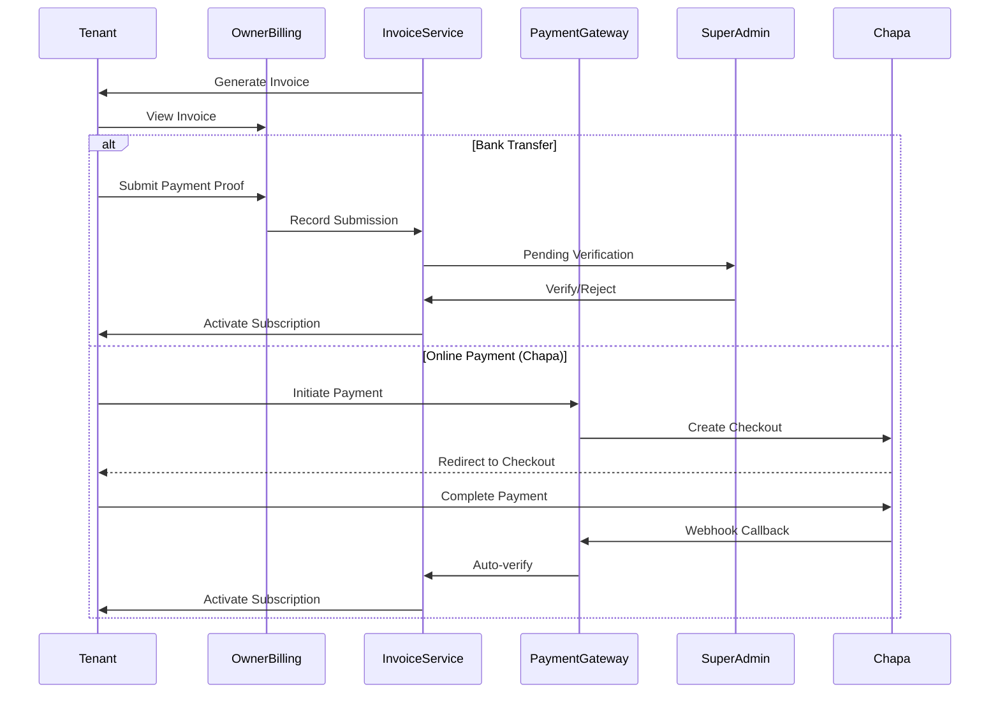

# MirachPOS Codebase Analysis Report

## Executive Summary

MirachPOS is a comprehensive multi-tenant Point of Sale (POS) system designed for Ethiopian cafes and restaurants with role-based access, subscription-based feature gating, and support for local payment methods (Chapa, Telebirr, CBE Birr). The codebase is well-structured but requires several improvements for enterprise production readiness.

---

## 1. Architecture Overview



### Technology Stack
| Layer | Technology |
|-------|------------|
| Frontend | React 18, TypeScript, Vite, TailwindCSS |
| Backend | Express.js, Knex.js |
| Database | MySQL |
| Desktop | Electron |
| Payment | Chapa, Telebirr, CBE Birr |

---

## 2. Role-Based Architecture

### Four User Roles

| Role | Home Screen | Primary Functions |
|------|-------------|-------------------|
| **Waiter** | Floor View | Order taking, payment, KDS, table management |
| **Branch Manager** | Branch Dashboard | Orders, customers, staff, inventory, reports, menu |
| **Cafe Owner** | Owner Dashboard | Multi-branch oversight, global finance, staff across locations |
| **Super Admin** | System Overview | Tenant management, billing, feature flags, system health |

### Role Pages Inventory

#### Waiter (14 screens)
- Dashboard (floor view), Menu (order builder), Review, Payment, Receipt
- Active Orders, Kitchen Status, KDS, History, Notifications
- System Status, Draft Simulator, Settings, Shift Report

#### Branch Manager (11 screens)
- Dashboard, Orders, Order Details, Floor Map, Table Details
- Customers, Menu Builder, Recipe Builder, Team, Settings, Reports

#### Cafe Owner (9 screens)
- Dashboard, Billing, Finance, Reports, Inventory
- Staff Management, Audit, Branches, Onboarding

#### Super Admin (15 screens)
- Overview, Tenants, Tenant Details, Onboarding
- Billing, Payment Config, Plans Matrix, Feature Flags
- System Health, Support, Audit, Settings, Demo Requests

---

## 3. Subscription & Feature Distribution System

### Subscription Tiers

| Tier | Monthly ETB | Yearly ETB | Branch Limit | Staff Limit | Key Features |
|------|-------------|------------|--------------|-------------|--------------|
| **Trial** | Free | Free | 1 | 5 | Core POS, limited inventory |
| **Basic** | Configured in DB | DB | 1 | 25 | Full POS, inventory, reports, finance |
| **Pro** | Configured in DB | DB | 3 | 100 | Multi-branch, KDS, guests, owner dashboard |
| **Enterprise** | Custom | Custom | 999 | 9999 | Unlimited, API, webhooks, custom integrations |

### Module-Based Feature Gating

```javascript
// Modules per tier (from entitlements.js)
Trial: ['pos', 'orders', 'tables', 'inventory', 'menu', 'staff', 'reports', 'settings']
Basic: ['pos', 'orders', 'tables', 'inventory', 'menu', 'staff', 'reports', 'finance', 'branches', 'settings']
Pro:   ['pos', 'orders', 'tables', 'guests', 'inventory', 'menu', 'staff', 'reports', 'finance', 'branches', 'owner_dashboard', 'settings']
Enterprise: [All modules + unlimited limits]
```

### Feature Distribution Matrix (from PlansMatrix.tsx)

| Feature | Trial | Basic | Pro | Enterprise |
|---------|-------|-------|-----|------------|
| POS Orders | ✓ | ✓ | ✓ | ✓ |
| Inventory Tracking | Limited | ✓ | ✓ | ✓ |
| Customer Loyalty | ✓ | ✓ | ✓ | ✓ |
| Kitchen Display (KDS) | — | — | ✓ | ✓ |
| Multi-Branch | — | — | ✓ | ✓ |
| Public API | Limited | Limited | ✓ | ✓ |
| Webhooks | — | — | ✓ | ✓ |
| Audit Log | — | — | ✓ | ✓ |
| Priority Support | — | — | ✓ | ✓ |
| Dedicated Account Manager | — | — | — | ✓ |

---

## 4. Payment & Billing System

### Payment Flow



### Payment Methods

| Method | Status | Implementation |
|--------|--------|----------------|
| **Bank Transfer** | ✅ Complete | Manual proof upload, superadmin verification |
| **Chapa** | ✅ Complete | Full API integration, webhook callbacks |
| **Telebirr** | ⚠️ Stub | Requires production credentials |
| **CBE Birr** | ⚠️ Stub | Requires merchant agreement |

### Grace Period & Enforcement

- **Default grace period**: 3 days (configurable per tenant)
- **Auto-downgrade**: On billing date, unpaid accounts downgrade to Basic with `past_due` status
- **Suspension**: After grace period expires, account is suspended
- **Scheduler jobs**: Payment reminders (3-day, 1-day, overdue), grace period checks (hourly)

---

## 5. Enterprise Production Readiness Issues

### 🔴 CRITICAL Issues

#### 1. Security Vulnerabilities

| Issue | Location | Risk | Fix |
|-------|----------|------|-----|
| **JWT secret from env only** | `auth.js:11` | HIGH | Add secret rotation, use HSM/Vault in production |
| **No rate limiting** | All routes | HIGH | Add express-rate-limit middleware |
| **No CSRF protection** | [app.js](file:///d:/Projects/mirachpos/api/src/app.js) | MEDIUM | Add csurf or stateless CSRF tokens |
| **Hardcoded config ID** | `platform_payment_config.id = 1` | LOW | Use proper config key lookup |
| **Console.log in production** | Multiple services | LOW | Use proper logging (Winston/Pino) |

#### 2. Missing Error Handling

```javascript
// Example from paymentGatewayService.js - catches but re-throws
} catch (error) {
    console.error('Chapa initialize error:', error);
    throw error;  // No user-friendly error transformation
}
```

**Recommendation**: Implement centralized error handling with proper error codes and user-friendly messages.

#### 3. No Input Validation

- Most route handlers lack input sanitization
- No use of validation libraries (Joi, Zod, express-validator)
- SQL injection possible via raw queries

---

### 🟠 HIGH Priority Issues

#### 1. Incomplete Payment Integrations

```javascript
// telebirrInitialize - Lines 169-217
// This is a stub, not a real implementation
console.log('Telebirr initialize payload:', payload);
return {
    success: true,
    message: 'Telebirr integration requires production credentials',
};
```

**Action Required**: Complete Telebirr and CBE Birr integrations before production.

#### 2. No Database Transactions

Critical operations like subscription activation span multiple tables without transactions:

```javascript
// activateSubscription updates: tenant_subscription, tenants
// Should use transaction to ensure atomicity
await db().from('tenant_subscription').update({...});
await db().from('tenants').update({...});  // If this fails, data is inconsistent
```

#### 3. Scheduler Reliability

- Using `setInterval` - not production-grade
- No job persistence across restarts
- No distributed locking for multi-instance deployments

**Recommendation**: Use Bull/BullMQ with Redis for job queue, or integrate with cloud scheduler (AWS EventBridge, GCP Cloud Scheduler).

#### 4. No API Versioning

All routes use `/api/...` without versioning. Breaking changes will affect all clients.

**Recommendation**: Implement `/api/v1/...` pattern.

---

### 🟡 MEDIUM Priority Issues

#### 1. Frontend State Management

- `PosContext.tsx` is 88KB (2200+ lines) - hard to maintain
- No state management library (Redux, Zustand)
- Prop drilling evident in component hierarchy

#### 2. Missing Observability

| Component | Missing |
|-----------|---------|
| Logging | Structured logging, log aggregation |
| Metrics | Prometheus/DataDog metrics |
| Tracing | Distributed tracing (OpenTelemetry) |
| Health Checks | Deep health checks (DB, gateway connectivity) |

#### 3. No Test Coverage

- No unit tests found
- No integration tests
- No E2E tests

#### 4. Notification Stubs

```javascript
// schedulerService.js - Lines 54-68
if (channel === 'email') {
    console.log(`[Scheduler] Email notification to ${recipient}: ${subject}`);
    status = 'sent';  // Not actually sent!
}
```

**Action**: Integrate with actual email (SendGrid/AWS SES) and SMS providers.

---

### 🟢 LOW Priority / Nice-to-Have

1. **Internationalization (i18n)**: UI is English-only, currency formatting is Ethiopian-specific
2. **Offline Support**: No PWA/service worker for POS reliability
3. **Audit Trail Completeness**: Some actions not logged
4. **Performance Optimization**: No pagination on some list endpoints
5. **Documentation**: No API documentation (OpenAPI/Swagger)

---

## 6. Recommended Implementation Roadmap

### Phase 1: Security Hardening (2-3 weeks)

- [ ] Add rate limiting middleware
- [ ] Implement proper input validation (Zod/Joi)
- [ ] Add CSRF protection
- [ ] Replace console.log with structured logging
- [ ] Add security headers (helmet.js)
- [ ] Implement API key rotation mechanism

### Phase 2: Payment System Completion (2-4 weeks)

- [ ] Complete Telebirr integration (requires merchant onboarding)
- [ ] Complete CBE Birr integration (requires bank agreement)
- [ ] Add payment webhook signature verification
- [ ] Implement idempotency for payment operations
- [ ] Add payment retry logic

### Phase 3: Reliability Improvements (2-3 weeks)

- [ ] Wrap critical operations in database transactions
- [ ] Replace setInterval scheduler with Bull/BullMQ
- [ ] Add distributed locking for scheduler jobs
- [ ] Implement circuit breaker for external services
- [ ] Add comprehensive health checks

### Phase 4: Observability (1-2 weeks)

- [ ] Integrate structured logging (Pino/Winston)
- [ ] Add Prometheus metrics
- [ ] Implement distributed tracing
- [ ] Set up alerting

### Phase 5: Testing (3-4 weeks)

- [ ] Add unit tests for services
- [ ] Add integration tests for API routes
- [ ] Add E2E tests for critical flows (subscription, payment)
- [ ] Set up CI/CD pipeline with test gates

### Phase 6: Notifications (1-2 weeks)

- [ ] Integrate email service (SendGrid/AWS SES)
- [ ] Integrate SMS service (Africa's Talking/Twilio)
- [ ] Add notification templates
- [ ] Implement delivery tracking

---

## 7. Feature Comparison Summary

### Current State vs Enterprise Ready

| Capability | Current State | Enterprise Target |
|------------|--------------|-------------------|
| Multi-tenancy | ✅ Complete | ✅ |
| Role-based Access | ✅ Complete | ✅ |
| Subscription Billing | 🟡 Partial (bank+Chapa only) | Full payment integration |
| Feature Flags | ✅ Complete | ✅ |
| Limit Enforcement | ✅ Complete | ✅ |
| Security | 🔴 Basic | Full hardening |
| Observability | 🔴 None | Complete stack |
| Testing | 🔴 None | 80%+ coverage |
| Documentation | 🔴 Minimal | OpenAPI + guides |
| Offline Support | 🔴 None | PWA capability |

---

## 8. Conclusion

MirachPOS has a solid foundation with well-designed multi-tenancy, role-based access control, and subscription-based feature gating. The application architecture is sound, but several critical areas need attention before enterprise deployment:

1. **Security hardening is the top priority** - rate limiting, input validation, and proper error handling
2. **Complete payment integrations** - Telebirr and CBE Birr are stubs
3. **Add observability** - logging, metrics, and tracing are essential for production operations
4. **Implement testing** - no test coverage is a significant risk

The subscription/billing system is well-designed with proper proration, grace periods, and enforcement mechanisms. The feature distribution across tiers is logical and the RBAC system is comprehensive.
